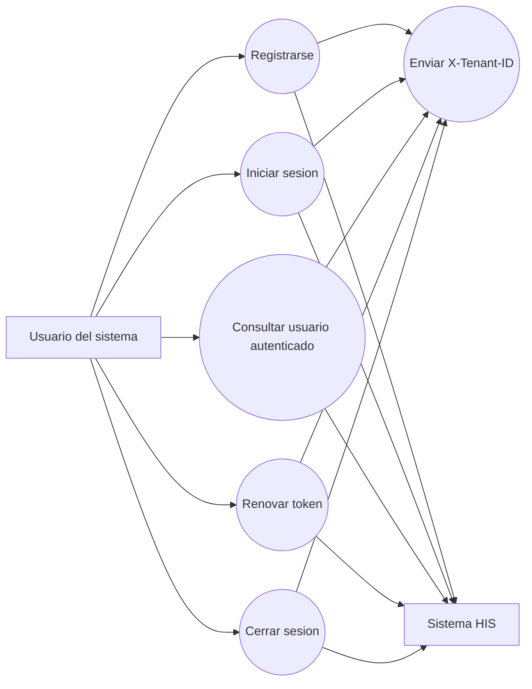

# Diagrama de caso de uso

## Modulo de autenticacion y acceso por tenant

## Descripcion

El usuario interactua con el modulo para registrarse, iniciar sesion, consultar su informacion, renovar el token y cerrar sesion. Todas las operaciones dependen del tenant enviado mediante `X-Tenant-ID`.

