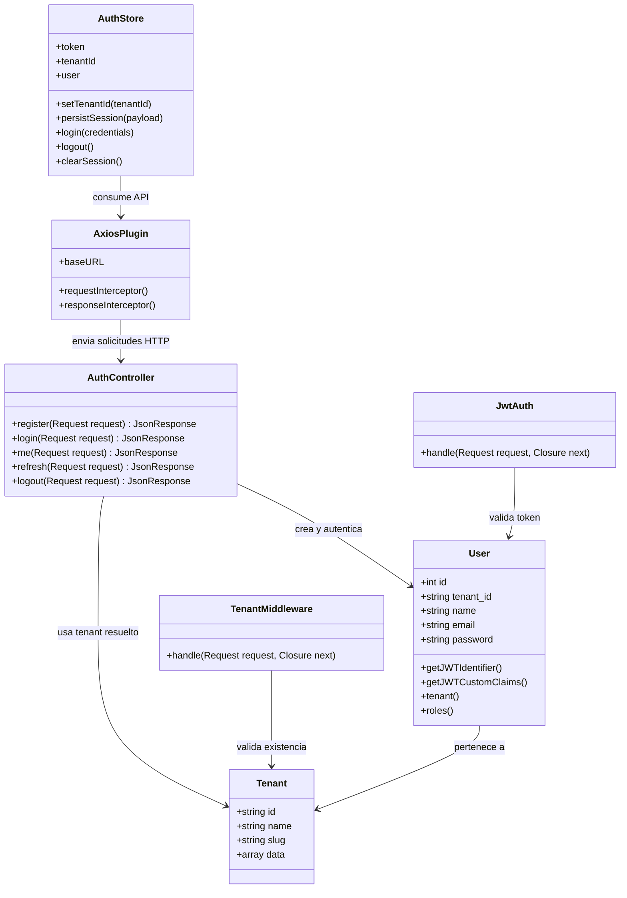

# Diagrama de clases

## Modulo de autenticacion y acceso por tenant

## Descripcion

El backend concentra la logica de autenticacion en `AuthController`, usando `User`, `Tenant`, `TenantMiddleware` y `JwtAuth`. El frontend usa `AuthStore` y el plugin Axios para guardar tenant, token y usuario en el navegador.

