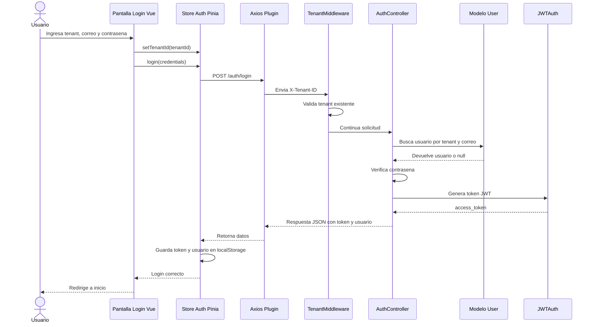

# Diagrama de secuencia

## Flujo de inicio de sesion

## Descripcion

El inicio de sesion requiere que el frontend envie el tenant en la cabecera `X-Tenant-ID`. Laravel valida el tenant, busca el usuario dentro de ese tenant, verifica la contrasena y genera un token JWT para la sesion.

